# Auduio User Manual

**Auduio** is a music studio that runs in your web browser, as a desktop app (Windows, macOS, Linux) and on phones.
You can record your voice or instruments, play synthesizers and drums, build beats with a step sequencer,
cut and arrange your recordings, and make it all sound good with one button (Auto-Mix).

This manual uses plain words. Where a music word is needed, it is explained the first time.

> **Tip for everyone:** you cannot break anything. Every change can be taken back with **Undo**
> (the curved arrow at the top, or **Ctrl+Z** on Windows/Linux, **Cmd+Z** on a Mac).

### Contents

[TOC]

## 1. Getting started

**Which version?** Use Auduio in a web browser, or install the desktop app:

- **Windows:** run the `.msi` or `-setup.exe` installer.
- **macOS:** open the `.dmg` and drag Auduio to Applications.
- **Linux (Debian, Ubuntu and similar):** open the `.deb` file with your software installer, or run
  `sudo apt install ./Auduio_0.5.1_amd64.deb` in a terminal. There is no AppImage.
- **Android:** see the install guide that comes with the `.apk` file.

Only the desktop app can load plugins (VST3 and CLAP).

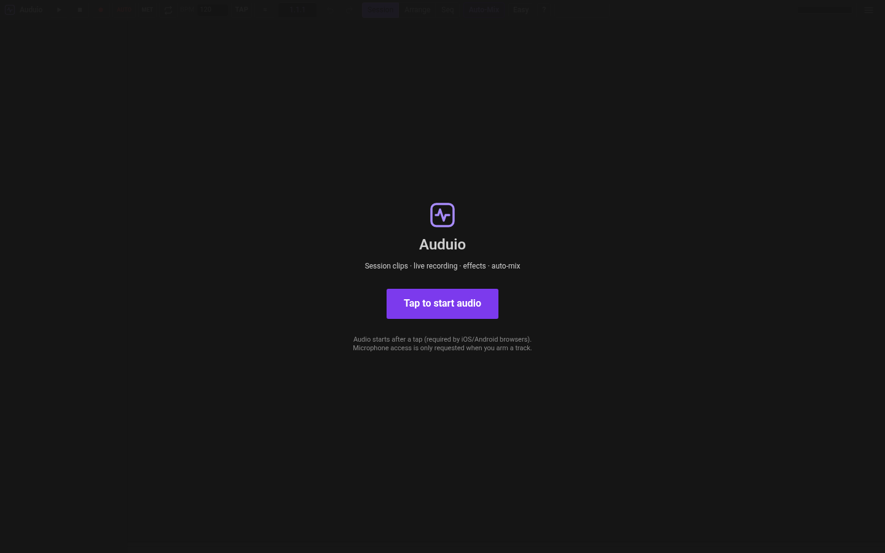

1. Open Auduio. You see a start screen.
2. Press **Start** (the big button). Browsers need one click before they are allowed to make sound.
3. A new song opens with two empty tracks. Your work is **saved automatically** in this browser.

**What is a track?** A track is one lane for one sound: one for your voice, one for a guitar, one for drums.

The screen has five main parts:

| Part | Where | What it does |
|---|---|---|
| Top bar | top | Play, Stop, Record, tempo, Undo, the two views, **KEYS**, Auto-Mix, Help and the Menu |
| Browser | left | All instruments and effects; drag one onto a track or double-click it |
| Main view | middle | **Session** or **Arrange** (switch with the buttons or the **Tab** key) |
| Sequencer panel | right | The step sequencer of the selected track, in both views (see section 13) |
| Device panel | bottom | The instrument and effects of the selected track, with knobs |

---

## 2. The transport (play, stop, record, tempo)

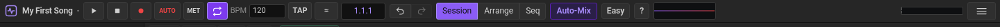

From left to right:

- **Play** (triangle) starts and stops the music. Shortcut: **Space**.
- **Stop** (square). Press it twice to go back to the start.
- **Record** (red circle) records every *armed* track. Shortcut: **R**.
  To arm a track, press its round arm button; it turns red.
- **AUTO** waits until you start playing or singing, then starts recording by itself (with a little pre-roll so the first note is not cut off).
- **MET** turns the metronome (the click) on and off. Shortcut: **Shift+M**.
- **KEYS** turns your computer keyboard into a music keyboard (see below). Shortcut: **M**.
- **Loop** (two arrows) repeats the part between the loop markers.
- **BPM** is the tempo (speed) in beats per minute. Type a number, or press **TAP** on the beat 3 to 8 times. Shortcut: **T**.
- **≈ Auto-timing** listens to a band playing, finds the tempo, can follow it live and then lock it.
- The **position** display shows bar . beat . sixteenth.

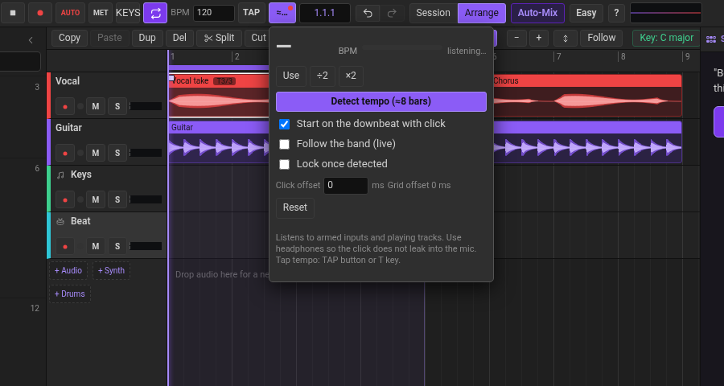

**Playing notes with the computer keyboard (KEYS):** press **KEYS** (or **M**). A small keyboard panel appears.

- The keys **A W S E D F T G Y H U J K O L P ;** play notes like piano keys (A = C, W = C#, S = D ...).
- **Z** and **X** move one octave down and up. **C** and **V** make notes softer and louder (velocity).
- You can also click the keys of the small piano in the panel.
- The notes go to the armed instrument track, or to the selected one. They are recorded when you record,
  into a clip or into the step sequencer (**Step** and **Live** recording).
- While you type in a text box nothing is played, and when you switch to another window all notes stop.

**USB MIDI keyboards:** plug one in and arm an instrument track. Browsers with Web MIDI (Chrome, Edge, Firefox) and the
desktop app on Windows, macOS and Linux (there the audio engine reads the keyboard) both work.

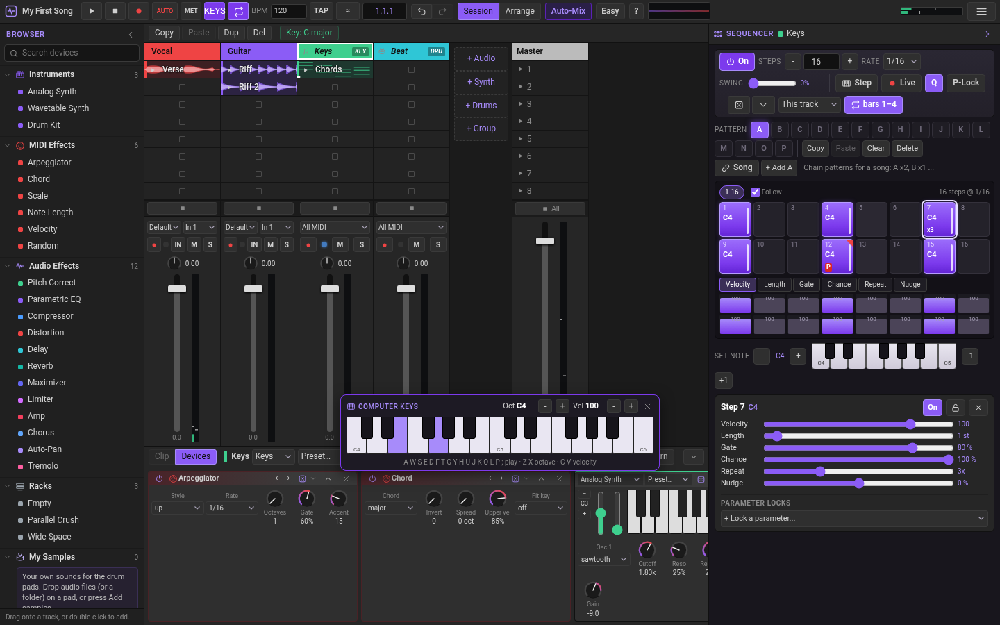

---

## 3. The loop bar and take recording

The **loop bar** is the purple bracket above the timeline in the **Arrange** view.

- Drag its ends to choose which bars repeat. Click **Loop** (or press **Ctrl/Cmd+L** on a selected clip) to loop exactly that clip.
- While the loop is on, playback jumps back to the start of the loop every time.

**Take recording:** press **Record** while the loop is on and sing or play the part several times in a row.
Every pass is kept as a **take**. The clip shows a badge like **T3/3** (take 3 of 3).
Long-press or right-click the clip and choose **Take 1**, **Take 2** ... to pick the best one. Nothing is thrown away.

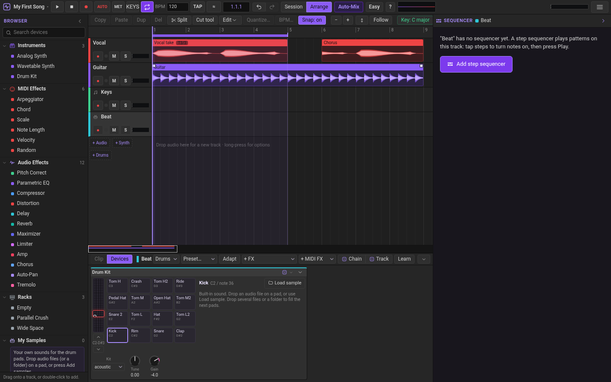

---

## 4. Tracks and clips

A **clip** is a piece of sound on a track: a recording, an imported audio file, or MIDI notes.

**Two ways to work:**

- **Session view:** a grid of clip slots. Click a clip to start it looping; click another one to switch. Great for trying ideas.
- **Arrange view:** a timeline from left to right, like a tape. Great for building the finished song.

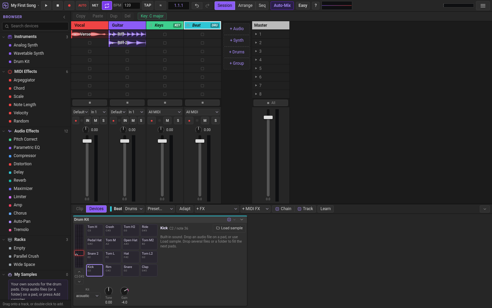

**Adding tracks:** use **+ Audio** (microphone or line in), **+ Synth**, **+ Drums** or **+ Group** at the end of the Session view,
or at the bottom of the sequencer panel (**+ Synth** / **+ Drums**).

**Working with clips:**

- **Move:** drag a clip. It snaps to the beat unless you hold **Alt** or **Shift** (or turn **Snap** off).
- **Copy / Paste / Duplicate:** **Ctrl/Cmd+C**, **Ctrl/Cmd+V**, **Ctrl/Cmd+D**.
- **Delete:** select it and press **Delete**.
- **Preview:** click an audio clip to hear it on its own.
- **Import audio:** Menu > **Import audio files as tracks...**, or drop files onto the window.
- **Right-click or long-press** a clip for all options: move to Session, edit notes, quantize, detect tempo, rename, loop, takes, delete.

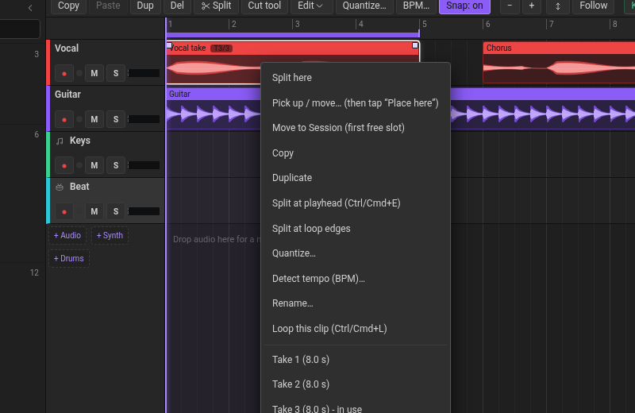

A track's menu (right-click or long-press its name) lets you rename it, change its colour (**Next colour**), group it and more.
**Groups** combine several tracks on one fader with their own effects.

---

## 5. Cutting and editing clips

There are several easy ways to cut clips. They all work the same for **audio clips and MIDI clips**,
and every cut is **one Undo step**.

| How | What happens |
|---|---|
| **Ctrl+E** (Mac: **Cmd+E**) or **S** | Split at the playhead. If a clip is selected, only that clip; otherwise every clip under the playhead on the selected track. |
| **Split** button (Arrange toolbar) | Same as Ctrl/Cmd+E. |
| **Cut tool** (button, or key **X**) | A red line follows the mouse. Click a clip where you want to cut it. Hold **Alt/Shift** for a cut that does not snap to the beat. Press **X** or **Esc** to go back to normal. |
| **Split here** (right-click / long-press a clip) | Cuts exactly where you pressed. |
| **Edit > Split at loop edges** | Cuts every clip where the loop starts and where it ends. |
| **Edit > Delete loop section** | Removes everything inside the loop on all tracks and leaves a gap (silence). |
| **Edit > Cut out loop section** | Removes the loop section and moves everything after it to the left, so the gap closes. |

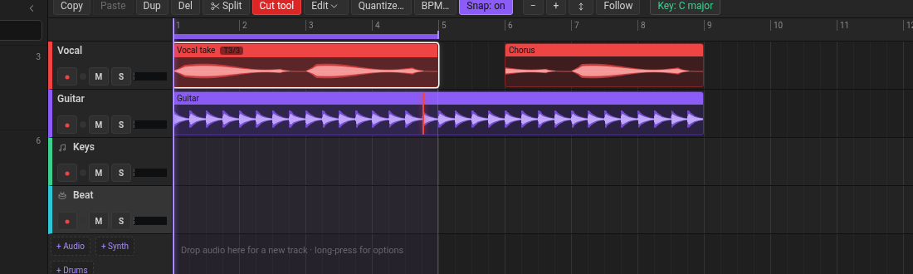

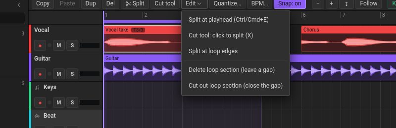

**Trimming a clip:** drag the left or right edge of an audio clip in the Arrange view (the mouse pointer becomes a
double arrow). You can also cut it and delete the piece you do not want, or put the loop over the part to remove and
use **Delete loop section**.

### Fine editing (micro editing)

For exact work, Auduio can edit down to single samples (a sample is the smallest piece of digital sound; there are
44,100 or 48,000 of them in one second).

- **Free placement:** hold **Alt** or **Shift** while you drag a clip, a clip edge, a fade or the loop to place it
  without snapping to the beat.
- **Nudge with the arrow keys:** select a clip and press **Left** / **Right** to move it one beat.
  **Alt+Left/Right** moves it 1 millisecond, **Alt+Shift+Left/Right** 10 milliseconds.
- **Zoom to single samples:** press **+** in the Arrange toolbar (or Ctrl+mouse wheel / pinch) again and again.
  The toolbar shows the scale (for example "1 sample = 2.0 px") and a fine ruler in milliseconds appears.
  The clip editor at the bottom (click an audio clip, then **Clip**) zooms down to single samples as well; each sample is a dot.
- **Fades:** move the mouse over an audio clip; small handles appear in its top corners. Drag the left one to the right
  for a **fade in**, the right one to the left for a **fade out**. The fade is shown as a line over the waveform.
- **Exact numbers:** in the clip editor you can type the clip's **Position**, **Length** and **Offset** (in seconds,
  with milliseconds) and the **Fade in** / **Fade out** (in milliseconds). Press **Enter** to apply.
- **MIDI notes:** in the piano roll, click a note, then type its **Start**, **Length** (in beats) and **Vel** (velocity),
  or use the keys: **Left/Right** move it by the grid, **Alt+Left/Right** by 1 tick (1/960 of a beat),
  **Shift+Left/Right** change the length, **Up/Down** the pitch (**Shift** = octave), **Ctrl/Cmd+Up/Down** the velocity.
  Hold **Alt** or **Shift** while dragging a note to move it freely. **Ctrl/Cmd+Z** undoes inside the piano roll.

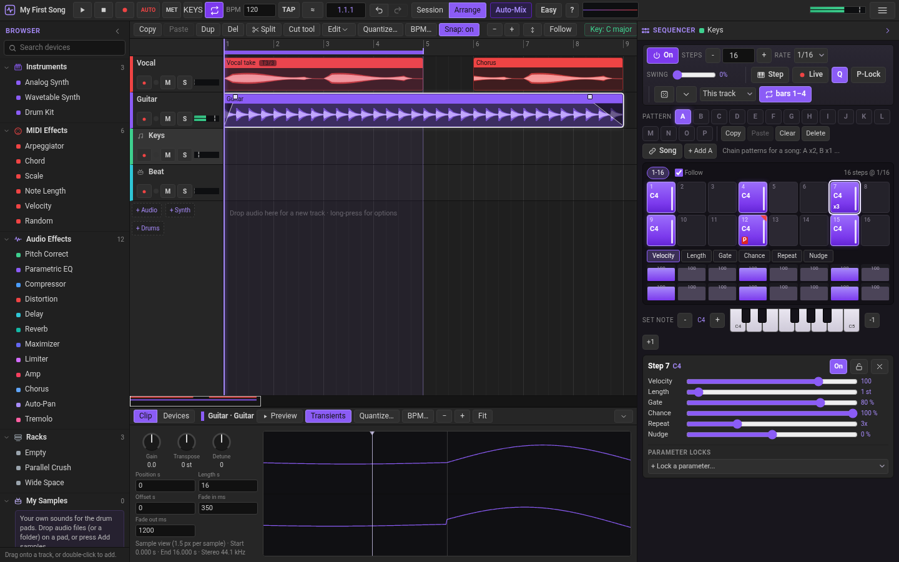

**On a phone:** go to **Tracks**, press and hold a clip, and choose **Split here** (cuts at the playhead),
**Split in half**, **Split at loop edges**, **Move** or **Delete**. See section 13.

---

## 6. Instruments

MIDI tracks play notes on an instrument. MIDI simply means *notes* (which key, how hard, how long), not sound.
Auduio has three built-in instruments:

- **Analog Synth:** warm classic synthesizer (oscillators, filter, envelopes).
- **Wavetable Synth:** modern, evolving sounds.
- **Drum Kit:** 128 drum pads. They start with built-in drum sounds (made in code), and you can put **your own samples** on any pad (see below).

Play them with a MIDI keyboard, the on-screen keyboard in the device panel, or the step sequencer.
Double-click a MIDI clip to open the **piano roll** and draw or edit notes.

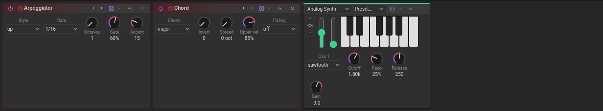

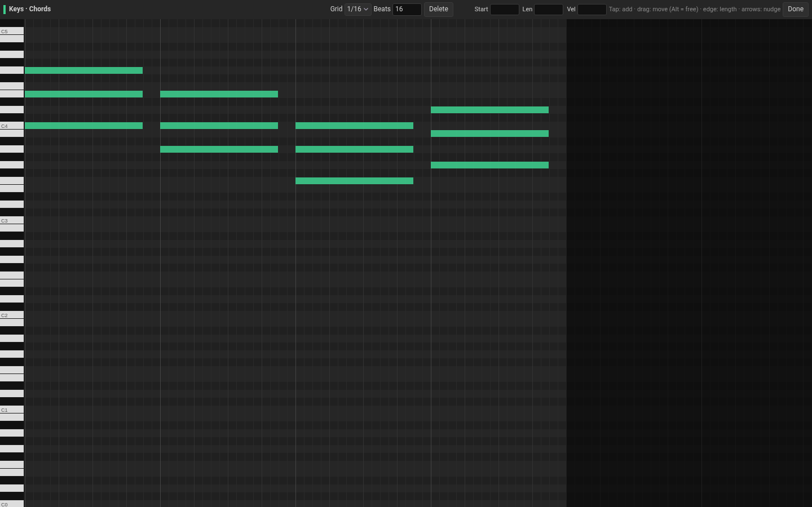

### Drum Kit: 128 pads and your own samples

The Drum Kit works like a drum machine with **128 pads**, one for every MIDI note (0 to 127).
You see **16 pads** at a time (4 by 4). The lowest pad is bottom-left, the highest top-right. It starts on **Kick** (note 36).

Next to the pads is a thin **overview strip** that shows all 128 pads as tiny squares:

- A **lit square** is a pad with your own sample. A dimmer square is a pad used in a pattern or clip.
- The **red frame** shows which 16 pads you are looking at.
- **Click or drag** in the strip to show other pads. The small arrows below it move one row (4 pads) up or down.
  The mouse wheel works too.

**Putting your own sound on a pad**

| How | What happens |
|---|---|
| **Drag an audio file** onto a pad | The pad now plays your file. |
| **Drag several files or a whole folder** onto a pad | They fill that pad and the next ones, in name order (kick1, kick2, ... kick10). Up to 128. |
| Select a pad and press **Load sample** | Choose a file from your computer or phone. |
| **Right-click** a pad (phone: **hold** it) | **Load sample...**, **Load a folder (fills pads from here)...**, **Clear pad**, **Play**. |
| **My Samples** in the browser | Every sample you have loaded. Drag one onto a pad, or double-click it to put it on the selected pad. |

Accepted files: **WAV, AIFF, MP3, FLAC and OGG**, up to **50 MB** each. Files are checked before they are used; a
file that is damaged or is not really audio is refused with a short message, and nothing else changes. Very long
files are cut to **30 seconds** (drum sounds are short).

**Pad settings** (click a pad to select it; the settings appear next to the pads):

- **Waveform:** drag the **red lines** to trim where the sound starts and ends. **Start** and **End** do the same.
- **Gain:** louder or softer. **Pitch:** higher or lower, in semitones (12 = one octave).
- **One-shot** plays the whole sound on every hit. **Gate** stops the sound when the note ends or you let go of the pad.
- **Choke:** pads in the same choke group cut each other off. Put an open and a closed hi-hat in group 1, so the closed hat stops the open one.
- **Replace** loads a different file; **Clear** removes the sample, and the pad plays its built-in sound again.

Every change can be undone. Your samples are **saved inside the project**, so they are still there after you close
Auduio, and they travel with the project when you export it (.zip). To save memory, a sample is only loaded when it is
needed (when it is on screen, used in a pattern or clip, or played).

In the **step sequencer**, the drum rows are the same 16 pads that you see in the Drum Kit, and the overview strip is
next to them there too. Scroll to other pads to program them.

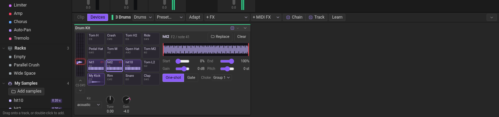

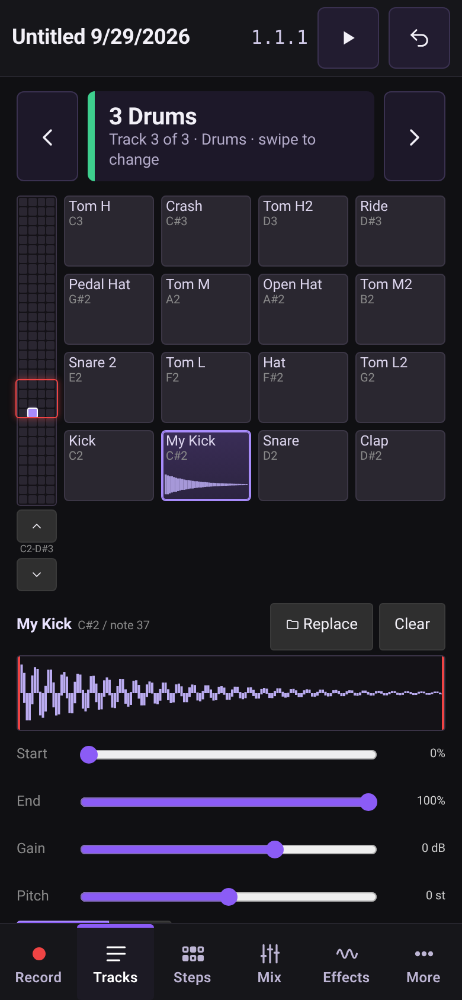

---

## 7. Pitch Correct

**Pitch Correct** moves sung notes to the nearest correct note of the song's key.

1. Select your vocal track.
2. In the browser, double-click **Pitch Correct** (or pick it from **+ FX**).
3. Set the key at the top (**Key: C major** button) or let Auduio detect it.
4. **Speed:** 0 = hard robotic effect, higher = natural. **Human** leaves a little natural wobble. **Amount** and **Mix** set how strong it is.

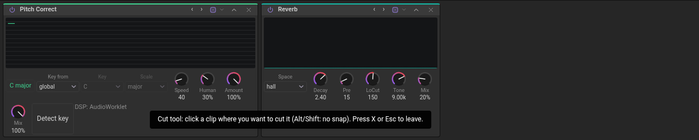

---

## 8. Auto-Mix

**Auto-Mix** makes all tracks sound good together with one button.

1. Press **Auto-Mix** in the top bar.
2. For every track, Auduio suggests what it is (vocal, guitar, drums, bass ...). Change it if the guess is wrong.
3. Press **Apply**. Auduio sets up EQ (tone), compression (evens out loud and quiet) and effects for each track.

You can change anything afterwards, and **Undo** takes the whole Auto-Mix back.
**Adapt** on a track gently keeps adjusting its tone while you play live.

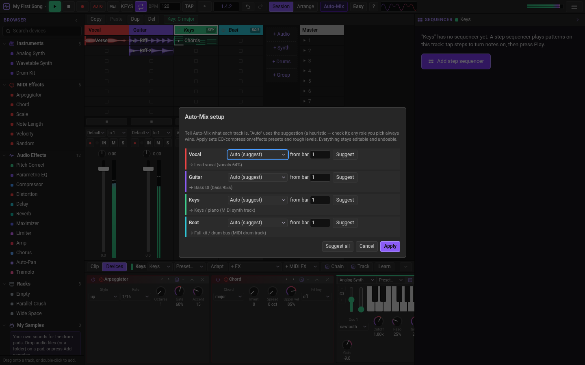

---

## 9. Effects and racks

Effects change the sound of a track: **Parametric EQ**, **Compressor**, **Reverb**, **Delay**, **Distortion**, **Amp**,
**Chorus**, **Auto-Pan**, **Tremolo**, **Maximizer**, **Limiter** and **Pitch Correct**.

- Add one by double-clicking it in the browser, dragging it onto a track, or using **+ FX**.
- Each effect card has knobs. Turn the power button to bypass it. Drag cards to reorder them.

A **rack** is a box of several effects side by side (parallel chains) with 8 **macro** knobs that turn many
settings at once. Try the ready-made racks **Parallel Crush** and **Wide Space**.

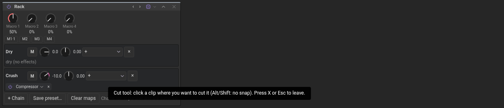

---

## 10. MIDI effects

MIDI effects change the notes *before* they reach the instrument:

- **Arpeggiator:** plays held chords as running notes.
- **Chord:** one key plays a whole chord.
- **Scale:** keeps every note inside the song key (no wrong notes).
- **Note Length:** makes notes shorter or longer.
- **Velocity:** makes notes louder, softer or more even.
- **Random:** adds small random changes for a human feel.

They also work on notes from the step sequencer.

---

## 11. The randomizer

Every device (instrument, effect, rack, MIDI effect, plugin) has a **dice** button. Press it for new, surprising settings.

- The small arrow next to the dice opens options: **Amount** (how much it changes), **Musical** (keeps volume safe) or **Chaos** (anything goes).
- Click a parameter in the list to **lock** it. Locked settings are never changed.
- **Randomize track** or **chain** changes several devices at once.
- One press of **Undo** brings back everything.

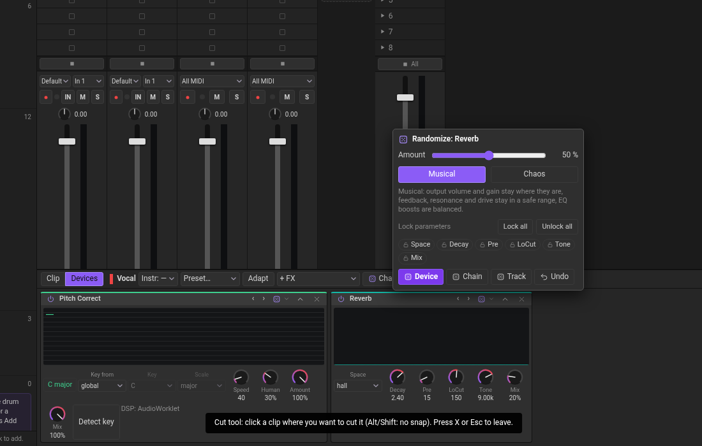

---

## 12. Plugins (desktop app)

The Auduio desktop app for Windows, macOS and Linux can load your **VST3** and **CLAP** plugins.
(Audio Unit plugins on macOS are not supported.)

1. In the browser, open **Plugins** and press **Scan**.
2. Drag a plugin instrument onto a MIDI track, or a plugin effect after it.
3. The plugin card shows its knobs; **Open plugin window** shows the plugin's own screen. Macros, automation and the randomizer work as well.

Browsers, phones and tablets cannot load plugins; the Plugins section says "Desktop app only" there.

*VST is a trademark of Steinberg Media Technologies GmbH, registered in Europe and other countries.*

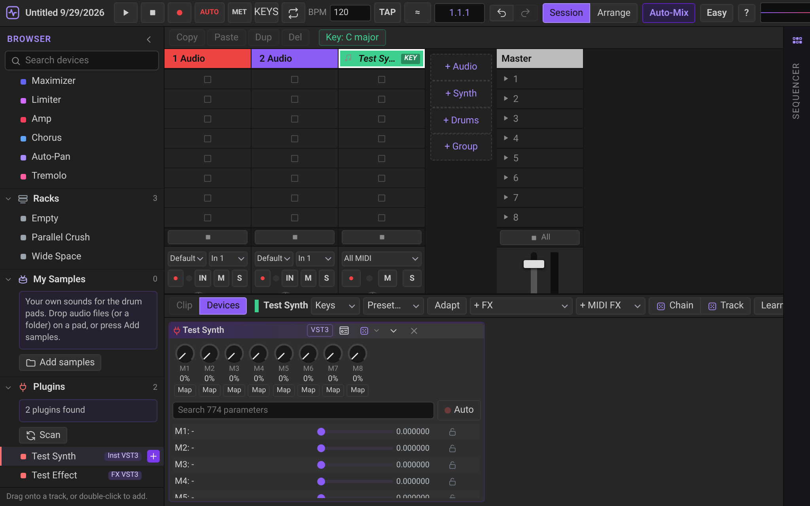

---

## 13. The step sequencer

The step sequencer builds patterns by turning steps on and off, like a drum machine.
It lives in the **sequencer panel** on the right side of the screen, in both the Session and the Arrange view,
and always shows the **selected track**.

- **Resize:** drag the panel's left edge (double-click it for the normal width).
- **Fold away:** press the arrow at the top right of the panel; press it again (or the word **Sequencer**) to open it.
- In a narrow window the panel starts folded and opens over the tracks.
- On a phone, press the **step sequencer button** in the top bar; the sequencer slides in from the side (section 14).

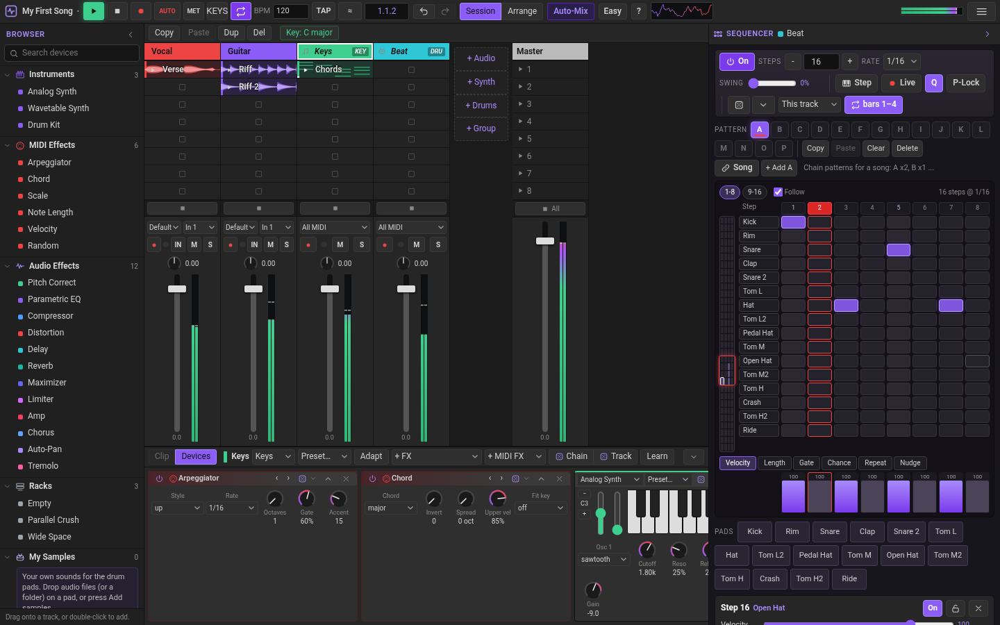

**First pattern in 4 steps:**

1. Look at the sequencer panel on the right (open it with its arrow if it is folded).
2. Press **New synth sequence** or **New drum sequence** (or select an instrument track and press **Add step sequencer**).
3. Tap the squares (steps) to turn notes on. For drums, each row is one drum.
4. Press **Play**. The red light runs over the steps.

**The parts of the sequencer panel, from top to bottom:**

- **Header:** the selected track's name and the fold arrow. Select another track to see its sequencer.
- **Toolbar:** **On/Off**, **Steps** (pattern length, 1 to 128), **Rate** (how long each step is: 1/4, 1/8, 1/16, triplets ...),
  **Swing**, **Step** record, **Live** record, **Q** (quantize), **P-Lock**, the dice (**randomize**),
  where the notes go (**This track**, **MIDI out** or both) and the **Loop** button.
- **Pattern** slots **A** to **P**: 16 patterns per track. Click an empty slot to make a new pattern (Shift+click copies the current one).
  While playing, the new pattern starts when the current one ends (the slot blinks until then).
- **Song** chain: press **+ Add** to put the current pattern at the end of the chain, set repeats with **-** and **+**,
  then turn **Song** on. The chain plays in order (for example A x2, B x1) and starts again.
- **Step grid:** 16 steps per page (8 when the panel is narrow); more pages appear for longer patterns. **Follow** keeps the page with the playhead.
- **Lanes** under the grid: pick **Velocity**, **Length**, **Gate**, **Chance**, **Repeat** or **Nudge** and draw over the bars.
- **Keys:** a small keyboard (or drum pads) to set notes.
- **Step editor** (beside the grid when the panel is wide, below it when narrow): click a step's **number** (or hold the step) to edit it.
- **+ Synth / + Drums** at the bottom make a new instrument track with a sequencer.

**Step settings (every step has its own):**

| Setting | Meaning |
|---|---|
| Note | Which note (several notes make a chord) |
| Velocity | How hard (1-127) |
| Length | How many steps the note lasts |
| Gate | How much of that length is held (short = staccato) |
| Chance | Probability: the chance the step plays each time round |
| Repeat | Ratchet: plays the step 2 to 8 times quickly |
| Nudge | Plays the step a little early or late |
| Parameter locks | Any knob of this track's devices can have its own value on this step |

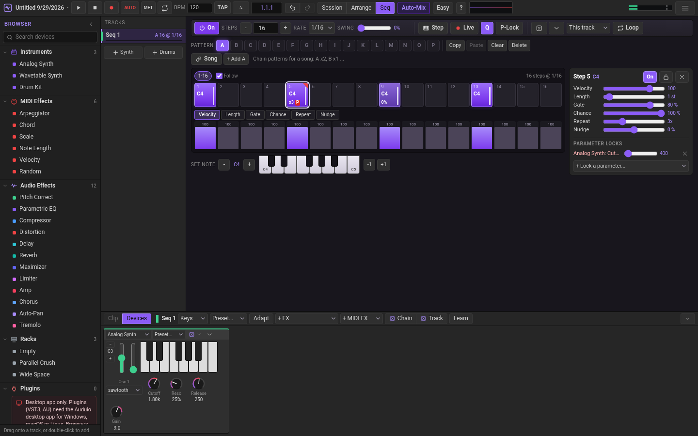

**Parameter locks (P-Locks):** select one or more steps, press **P-Lock**, then turn any knob of that track
(synth cutoff, reverb amount, a plugin parameter ...). The step plays with that value, then the knob goes back.
You can also use **+ Lock a parameter...** in the step editor. Steps with locks have a small red corner.

**Different lengths and speeds per track:** give the drums 16 steps and the bass 12, or one track 1/16 and another 1/8t.
The patterns drift against each other and meet again later: that is called **polymeter** and **polyrhythm**, and it makes grooves more interesting.

**Recording into patterns:**

- **Step:** press **Step**, then play notes (MIDI keyboard, computer keyboard with **KEYS**, or the on-screen keys). Each note fills the next step.
  **Rest** skips a step, **Tie** makes the previous note longer. Notes played together on a MIDI keyboard make a chord.
- **Live:** press **Live** and **Play**, then play along. Notes land on the nearest step. With **Q** off, your timing is kept as nudge.

**Randomize a pattern:** press the dice. Protect a step with the lock button in the step editor, or lock whole
settings (for example **Notes**) in the dice options; locked things are never changed.

**MIDI out:** choose **MIDI out** or **Track + MIDI** to play an external synthesizer or drum machine
(pick the port and channel). This works in browsers with Web MIDI (Chrome, Edge, Firefox) and in the desktop app on
Windows, macOS and Linux (there the audio engine sends the MIDI).

The sequencer follows **Play**, **Stop** and the **loop bar**, and everything can be undone.

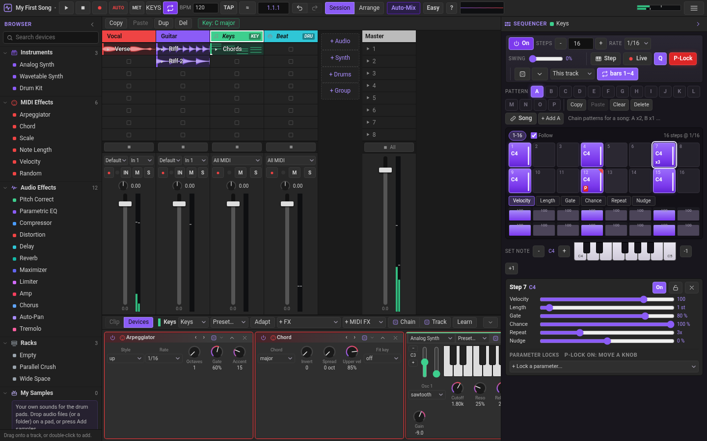

---

## 14. Phone mode

On a phone Auduio shows a simple layout with big buttons and five tabs at the bottom:
**Record**, **Tracks**, **Mix**, **Effects**, **More**. Swipe left and right to change the track.
The **step sequencer button** in the top bar slides the step sequencer in from the side; the **X** closes it.
Buttons give a short vibration (haptics) when you press them; you can turn this off in Settings.

| | |
|---|---|
| 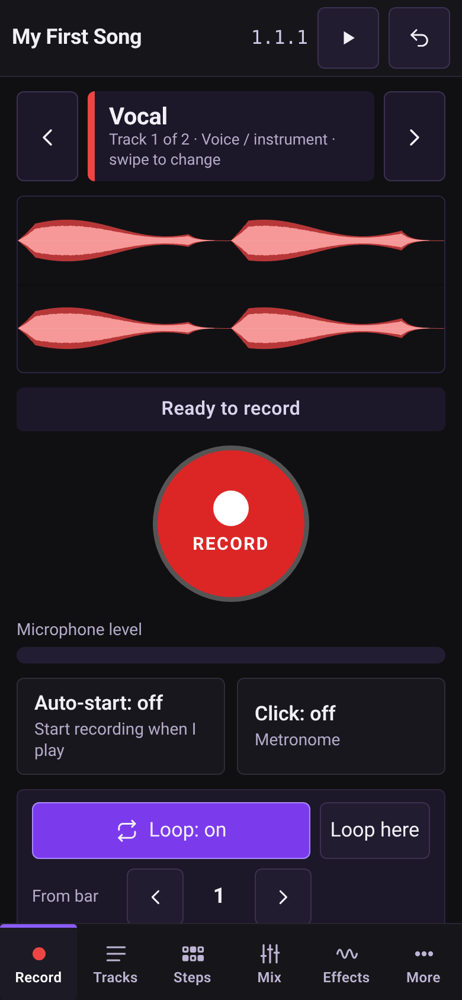 | 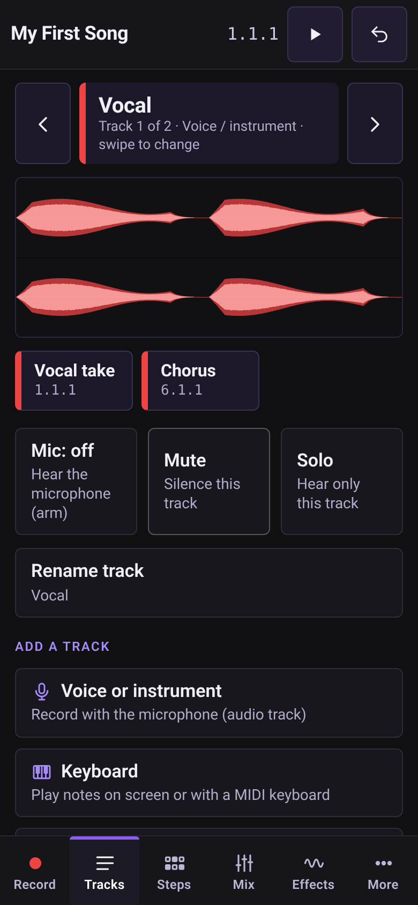 |
| 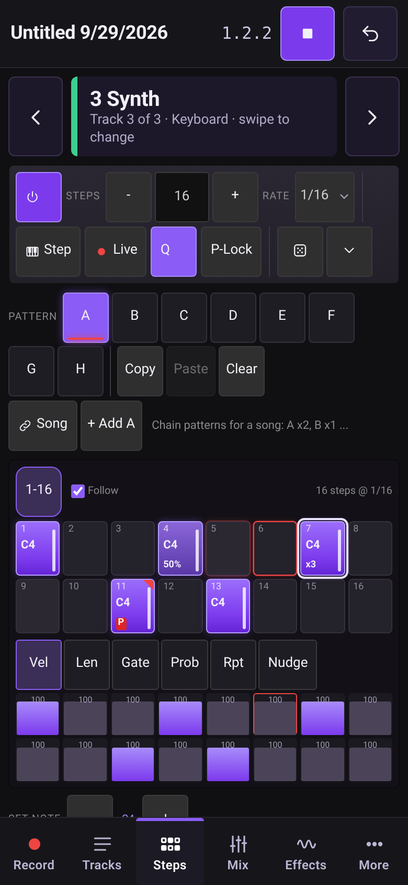 | 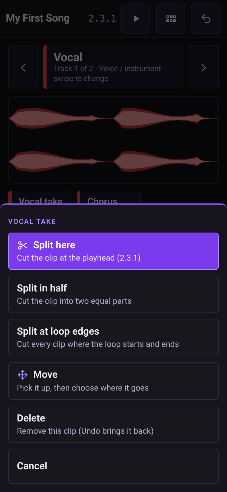 |
| 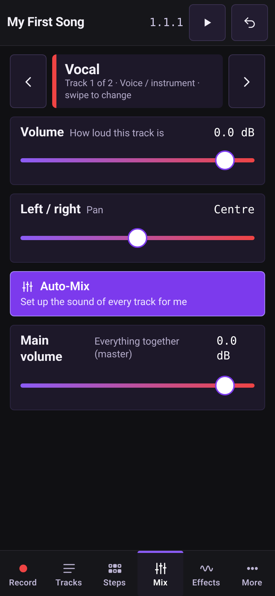 | 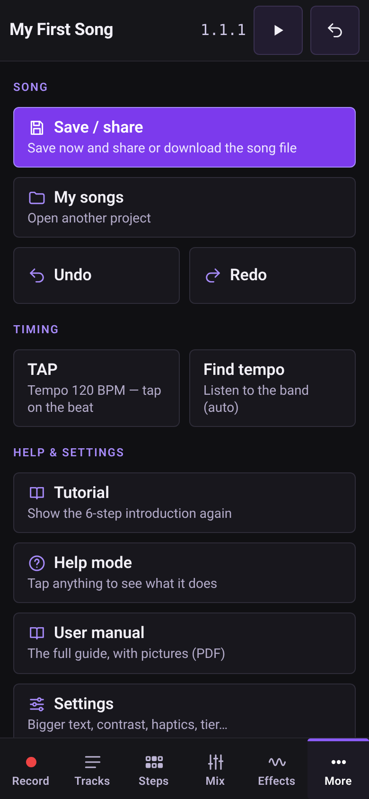 |

- **Record:** one big red button. Tap to record, tap again to stop.
- **Tracks:** waveform, clips, arm, mute, solo, add tracks. **Hold a clip** for **Split here**, **Split in half**, **Move** and **Delete**. On a **drum track** the Tracks tab shows the 16 big drum pads with the overview strip; **hold a pad** for **Load sample**.
- **Step sequencer** (top bar button): 8 steps per row. Hold a step to edit it.
- **Mix:** volume of every track and **Auto-Mix**.
- **Effects:** add simple effects such as "Space" (room sound) or "Make it louder".
- **More:** save, share, tempo, tutorial, settings, help, **User manual**, and **Show full layout**.

On tablets and computers you can switch between the layouts: Menu > **Simple phone layout**, and on the phone **More > Show full layout**.

---

## 15. Help, Easy Mode, saving and safety

- **? (Help mode):** press **?**, then click anything to see what it does.
- **Easy:** shows fewer controls with bigger labels.
- **Tutorial:** Menu > **Tutorial** walks you through the basics.
- **User manual:** Menu > **User manual (PDF)** (also in the Help mode bar, and on the phone **More > User manual**) opens this document. In a web browser it opens in a new tab; in the desktop app it is saved to your Downloads folder.

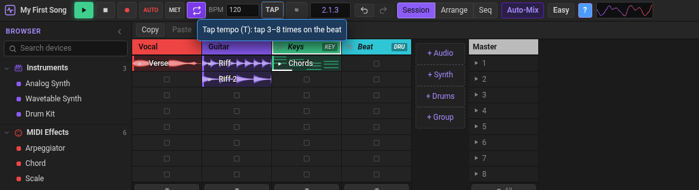

**Saving:** your song is saved automatically in this browser. The **Menu** has **Projects...** (open other songs),
**Save now**, **Export project (.zip)** to move a song to another computer, **Export encrypted...** (password-protected),
and **Import project...**.

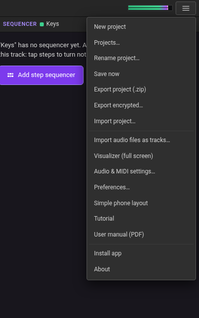

**Privacy:** Auduio has no accounts, no analytics, no telemetry and no ads. It does not collect, track or send
any personal data, projects or recordings; everything stays on your device. The web version only downloads the app itself.
(The Windows installer may download Microsoft's WebView2 runtime if your computer does not have it.)
The microphone and MIDI devices are used only after you allow them.

**Safety:** imported projects are checked strictly before they are opened. You can set a PIN in **Preferences** to protect saved projects.

**Licences:** Menu > **About** > **Licences...** lists the open-source components Auduio uses and their licences.
VST is a trademark of Steinberg Media Technologies GmbH, registered in Europe and other countries.

---

## 16. Keyboard shortcuts

| Key | Action |
|---|---|
| Space | Play / stop |
| R | Record |
| M | Computer keyboard (KEYS) on/off |
| Shift+M | Metronome on/off |
| A W S E D F T G Y H U J K O L P ; | Play notes (when KEYS is on) |
| Z / X, C / V | Octave down / up, softer / louder (when KEYS is on) |
| T | Tap tempo |
| Tab | Switch view (Session, Arrange) |
| Ctrl/Cmd+Z | Undo |
| Ctrl/Cmd+Shift+Z or Ctrl+Y | Redo |
| Ctrl/Cmd+C / V / D | Copy / paste / duplicate clip |
| Delete | Delete the selected clip |
| **Ctrl/Cmd+E** or **S** | **Split at the playhead** |
| **X** | **Cut tool on/off** (Esc also leaves it) |
| Mouse wheel on the drum pad overview | Show higher or lower pads |
| **B** | Show or hide the browser |
| Ctrl/Cmd+L | Loop the selected clip |
| Alt or Shift while dragging | Place without snapping to the beat |
| Left / Right | Nudge the selected clip one beat (Alt = 1 ms, Alt+Shift = 10 ms) |
| Shift+click (sequencer) | Select a range of steps |

---

*Auduio v0.5.1 user manual. Auduio was formerly called WebDAW.*
